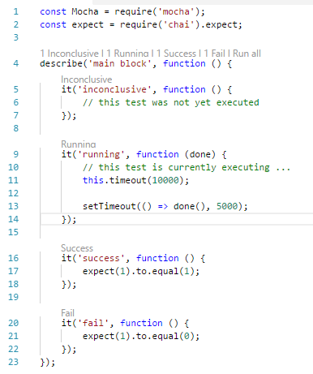

# Mocha test runner 

Creates code lens before each **describe** and **it** function call in test files.

Lense on **it** function shows last test result and can be used to run given test (using mocha --grep pattern - tests titles needs to be unique otherwise more than one test will be executed).

Lense on **describe** shows aggregated results from nested **it** and can be used to run all tests in given group / only test with specific status.

Tests not writen in javascript that mocha can load (es6 with import command, razor syntax, typescript, etc.) needs to be transpiled to es5 or es6 without import command - see example projects in .vscode-test directory. Mocha is searching for transpiled scripts ```**/*.test.js``` (configurable - **mocha.glob**) in project root directory or in **mocha.files.rootPath** (appended to project root directory).

## Preview:



## Examples:
- [es5 project](.vscode-test/es5-project): basic usage - no config or transpiling, just plain old javascript
- [es6 project](.vscode-test/es6-project): tests uses es6 import command - is transpiled to es5 with babel, this configuration can handle jsx syntax - react.js needs to be included via mocha.files.setup)
- [typescript project](.vscode-test/ts-project) tests writen in typescript - transpiled to es6 without use of import command by tsc, this configuration can handle tsx syntax - react.js needs to be included via mocha.files.setup
- [typescript project #2](.vscode-test/tsa-project) tests writen in typescript using arrow function syntax - transpiled to es5 by tsc, this configuration can handle tsx syntax - react.js needs to be included via mocha.files.setup
- [enzyme project](.vscode-test/enzyme-project) test writen in tsx syntax, tests budled with webpack - no need explicitly import react.js for test to work
- other project types: gulp, grunt-based transpiling, etc. may work too (not tested - im not a gulp/grunt-guru)

## Known issues:
- (Wont fix) Tests not wrapped by describe function are ignored. (mocha is not returning file path for these - no way to unique identify tests with same title in different files)
- Debugger wont see breakpoints in ts file when compiled with webpack (source maps issue)
