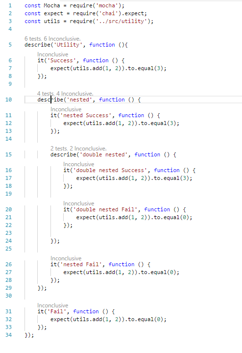
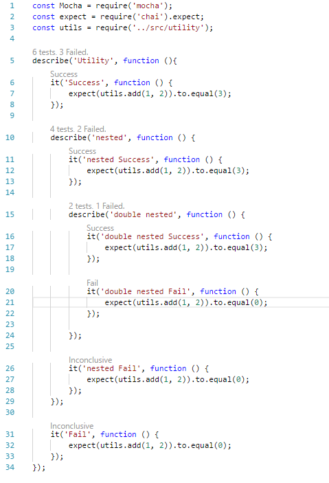

# vscode-mocha-test-runner

Adds codelens on mocha **describe** and **it** methods with information about test last run.
Runs specified test by clicking on codelens.

Code lens after opening vscode:

and after running all tests: 

## Known issues:

- Runner will not recognize tests not writen inside describe function.

- Cannot figure out how to start mocha and attach vscode debugger.

- Runner will not recognize new test files - reload required.